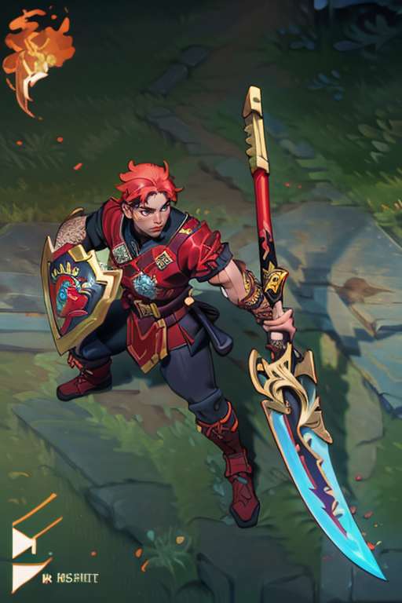

# LolSkinGenerator 🐦‍🔥

LolSkinGenerator is a Streamlit-based application that generates League of Legends skin concepts using Stable Diffusion models. The application allows users to input prompts and generate high-quality skin images with various customization options. 🎨✨

## Features 🌟

- Generate League of Legends skin concepts based on user prompts. 🖌️
- Support for multiple poses and high-resolution images. 📸
- Integration with ADetailer extension for enhanced face generation quality. 👤
- Download generated images directly from the application. 📥

## Requirements 📋

- Python 3.10 🐍
- Streamlit 🌐
- Stable Diffusion WebUI running locally 🖥️
- Required LoRa model: [`LeagueoflegendsSkins_concept-20`](https://civitai.com/models/174877/league-of-legends-skin-generator-preview-by-yeiyeiart)
- Recommended extension: [`ADetailer`](https://github.com/Bing-su/adetailer)

## Installation 🛠️

1. Clone the repository:
    ```sh
    git clone https://github.com/DaniRamirezVaquero/Lol_Skin_Generator.git
    cd Lol_Skin_Generator
    ```

2. Download the required LoRa model from [CivitAI](https://civitai.com/api/download/models/196344?type=Model&format=SafeTensor) and place it in your `models/Lora` folder.

3. (Optional) Install the ADetailer extension in your Stable Diffusion WebUI for better face generation quality.

4. Build and run the Docker container:
    ```sh
    cd docker
    docker-compose up --build
    ```

## Usage 🚀

You can run the application either inside the Docker container or directly with Streamlit.

### Running inside Docker 🐳

1. Ensure that Stable Diffusion WebUI is running locally.
2. Access the application at `http://localhost:8501`.
3. Select a model and sampler from the dropdown menus.
4. Enter a prompt to generate a skin.
5. Customize the generation options (multiple poses, high resolution).
6. Click "Generate Skin" and wait for the result.
7. Download the generated image if desired.

### Running directly with Streamlit 🌐

1. Ensure that Stable Diffusion WebUI is running locally.
2. Run the application:
    ```sh
    streamlit run streamlit_app.py
    ```
3. Access the application at `http://localhost:8501`.
4. Select a model and sampler from the dropdown menus.
5. Enter a prompt to generate a skin.
6. Customize the generation options (multiple poses, high resolution).
7. Click "Generate Skin" and wait for the result.
8. Download the generated image if desired.

## Demonstration 📸

Here are some example prompts and the resulting generated skins:

### Example 1
- **Model**: [`toonyou_beta6`](https://civitai.com/models/30240/toonyou?modelVersionId=125771)
- **Sampler**:`DPM++ SDE`
- **Multiple Poses**: ✅
- **High Resolution**: ✅
- **ADetailer**: ✅
- **Prompt:** 1girl, blue hair, blue dress


### Example 2
- **Model**: [`toonyou_beta6`](https://civitai.com/models/30240/toonyou?modelVersionId=125771)
- **Sampler**:`DPM++ SDE`
- **Multiple Poses**: ❌
- **High Resolution**: ✅
- **ADetailer**: ✅
- **Prompt:** 1boy, fire sword, shield, soldier



## Troubleshooting 🛠️

- If the application fails to connect to the API, ensure that Stable Diffusion WebUI is running and accessible.
- If no models are found, make sure you have placed the required models in the correct folders.
- For better face generation quality, install the ADetailer extension.

## License 📄

This project is licensed under the MIT License.
